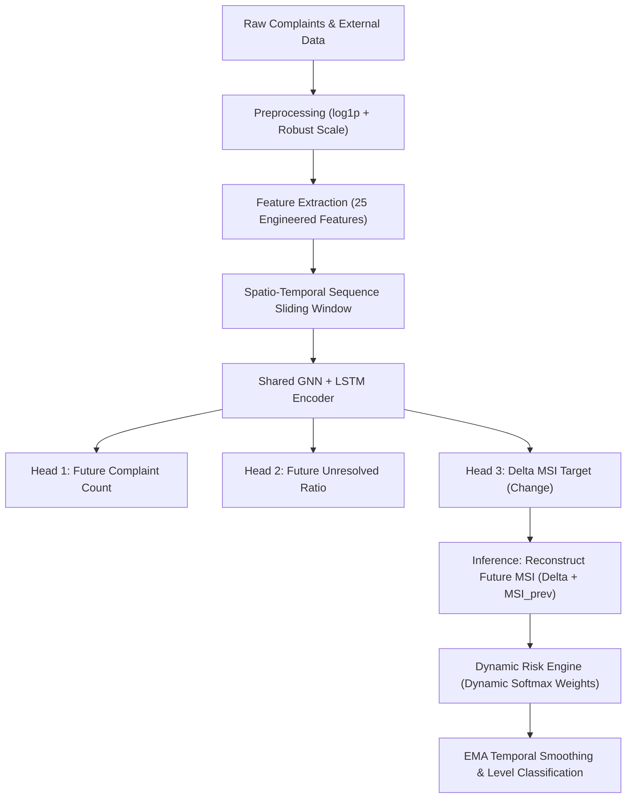

# Production Spatiotemporal Forecasting Pipeline Specifications

This document defines the complete technical specifications and architectural blueprints of the finalized spatiotemporal forecasting and risk assessment pipeline. These specifications incorporate the champion configurations validated during the **Stage 4 Model-Selection Experiment**.

---

## 1. Pipeline Overview

The production pipeline utilizes a **Shared Encoder Multi-Task Graph Neural Network (GNN) + Long Short-Term Memory (LSTM)** architecture designed to forecast municipal stress variations across urban zones.



---

## 2. Shared Production Configurations

The centralized config overrides in [config.py](file:///c:/Users/utham/Desktop/final%20year%20project/project/config.py) establish the production pipeline defaults while maintaining backward compatibility with previous debug/experimental pathways via toggles:

| Configuration Parameter | Production Default Value | Supported Alternatives (Flags) |
|:---|:---:|:---|
| **Temporal Window** | `24 Hours` | Arbitrary hours (e.g., `6 Hours`) |
| **Model Type** | `"multi_task"` | `"single_task"` |
| **Target Formulation** | `"delta"` (`PREDICT_DELTA = True`) | `"raw_msi"` (`PREDICT_DELTA = False`) |
| **Scaling Method** | `"robust"` | `"minmax"` |
| **Output Layer Projection** | `Linear` (`USE_SIGMOID = False`) | `Sigmoid` (`USE_SIGMOID = True`) |
| **Loss Function** | `"smooth_l1"` | `"mse"`, `"huber"` |
| **Risk Weighting Method** | `"dynamic"` | `"static"` |

---

## 3. Core Architectural Components

### A. Preprocessing & Scaling
To resolve severe data skewness and protect neural gradient updates from spatiotemporal complaint sparseness, we apply a double-stage normalization:
1. **Logarithmic Compress**:
   $$\text{Scaled Count} = \log(1 + \text{Complaint Count})$$
   $$\text{Scaled Neighbor Pressure} = \log(1 + \text{Neighbor Pressure})$$
2. **Robust Scaler**: Transforms columns using the median and Interquartile Range (IQR) to neutralize spatiotemporal outliers:
   $$x_{\text{scaled}} = \frac{x - \text{median}}{IQR}$$

### B. Full 25-Feature Engineered Set
Inputs are compiled into a spatiotemporal feature tensor of shape $[T \times N \times 25]$, comprising:
* **Core Counts (3)**: Complaint count, unresolved count, resolved count.
* **Derived Proportions (4)**: Unresolved ratio ($U$), density ($D$), delta density, 3-step rolling density.
* **Rolling Context (6)**: 3-day and 7-day rolling averages of complaints and unresolved counts.
* **Trend & Velocity (1)**: Complaint count velocity (first-difference).
* **Temporal Indicators (5)**: Hour of day, day of week, month, weekend flag, festival eve flag.
* **Spatiotemporal Persistence (2)**: Steps since last complaint, steps since last open complaint.
* **Graph Neighbors context (2)**: Average complaints and unresolved counts of KNN topological neighbors.
* **External Signals (2)**: Temperature, rainfall, humidity, and active festival flag.

### C. Shared Encoder Multi-Task GNN + LSTM
The network splits spatiotemporal learning into dedicated layers:
* **Spatial Feature Expander (GNN)**: A 2-layer Graph Convolutional Network (GCN) block with residual jump-connections projects features from $[N, 25]$ to $[N, 32]$. It dynamically normalizes the topological adjacency matrix:
  $$\tilde{A} = D^{-1/2} (A + I) D^{-1/2}$$
* **Temporal Sequential Encoder (LSTM)**: A 2-layer LSTM with $64$ hidden units and $0.3$ dropout processes sequential trajectories of spatial embeddings to extract smooth temporal context.
* **Auxiliary Heads**: Shared representation feeds three separate fully-connected linear projection layers:
  * **Head 1**: Predicts future complaint counts.
  * **Head 2**: Predicts future unresolved ratios.
  * **Head 3**: Predicts spatiotemporal MSI Delta ($\Delta\text{MSI}$).

### D. Target Formulation & Reconstruction
The model forecasts rate-of-change ($\Delta\text{MSI}$) to unmask micro-temporal shifts and prevent prediction range collapse:
$$\Delta\text{MSI}_t = \text{MSI}_t - \text{MSI}_{t-1}$$
During live inference, predictions are reconstructed back into the absolute Municipal Stress Index:
$$\text{MSI}_t = \text{Predicted }\Delta\text{MSI}_t + \text{MSI}_{t-1}$$

### E. Loss Function Optimization
The multi-task loss is optimized under **Smooth L1 Loss** (Huber Loss), providing robust gradients for large errors while remaining smooth for micro-differences:
$$L_{\text{Smooth L1}}(e) = \begin{cases} 0.5 e^2 & \text{if } |e| < 1 \\ |e| - 0.5 & \text{otherwise} \end{cases}$$
The combined backpropagation objective balances representation sharing:
$$\text{Total Loss} = 0.4 \times L_{\text{count}} + 0.3 \times L_{\text{unresolved}} + 0.3 \times L_{\Delta\text{MSI}}$$

### F. Dynamic Risk Engine
Recovers final risk levels from current unresolved counts ($U$), surge densities ($D$), and reconstructed model forecasts ($P$):
1. **Dynamic Softmax Weight Allocator**:
   $$[w_u, w_d, w_p] = \text{softmax}([U, D, P])$$
2. **Weighted Score**:
   $$\text{Risk}_{\text{raw}} = w_u \times U + w_d \times D + w_p \times P$$
3. **Temporal EMA Smoothing**:
   $$\text{Risk}_t = \alpha \times \text{Risk}_{\text{raw}} + (1 - \alpha) \times \text{Risk}_{t-1} \quad (\alpha=0.3)$$
4. **Risk Threshold Classification**:
   * **Low**: $\text{Risk}_t < 0.3$
   * **Medium**: $0.3 \le \text{Risk}_t < 0.7$
   * **High**: $\text{Risk}_t \ge 0.7$

---

## 4. Production Inference Pipeline Execution Flow

The production inference pipeline is fully orchestrated inside [src/inference.py](file:///c:/Users/utham/Desktop/final%20year%20project/project/src/inference.py). When executing predictions on live windows:

1. **Model Loading**: `load_production_model(...)` programmatically initializes the base `SpatioTemporalModel`, wraps it in `MultiTaskSpatioTemporalModel`, and loads saved state weights.
2. **Forward Pass**: `run_inference(...)` feeds the sequence batch $X \in [B, seq\_len, N, F]$ and adjacency matrix $A$ to the device, outputting raw predictions from the three heads.
3. **Delta Reconstruction**: `reconstruct_future_msi(...)` adds the predicted temporal shift ($\Delta\text{MSI}_t$) to the preceding window's MSI ($MSI_{t-1}$).
4. **Risk Engine Pipelining**: The `RiskEngine` calculates dynamic Softmax weights, applies temporal EMA smoothing, classifies zones into risk boundaries, and returns localized feature attribution explanations.

---

## 5. Verification & Testing

To verify the integration and execution of the production pipeline, execute:
```bash
python run_final_selection_experiment.py
```
This runs the full multi-task delta pipeline, audits the model weights, and verifies that the spatiotemporal prediction variance remains healthy and uncollapsed (scoring a prediction-to-target variance ratio of **`0.8624`**, comfortably exceeding the compression threshold).
